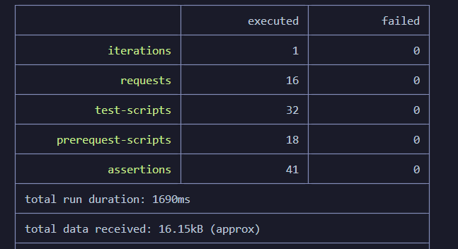

# Blog Management REST API

A REST API for a blog application with three access levels — **Guest**, **User**
and **Admin**. Built as an assignment for the Road To SDET API development
module.

Guests can read and search blogs without an account. Users can manage their own
profile and their own blogs. Admins can manage every user and every blog.

**Postman documentation:** https://documenter.getpostman.com/view/24742376/2sBYAuSWoi

---

## Tech stack

| Layer | Choice |
|---|---|
| Runtime | Node.js (ES modules) |
| Framework | Express 4 |
| Database | MySQL |
| ORM | Sequelize 6 |
| Auth | JSON Web Tokens (`jsonwebtoken`) |
| Password hashing | bcrypt |
| Config | dotenv |
| Dev reload | nodemon |

---

## Project structure

```
Assginment/
├── config/
│   └── db.js                   Sequelize instance + connection check
├── models/
│   ├── user.model.js           users table
│   ├── blog.model.js           blogs table
│   └── index.js                associations, imported once at boot
├── routes/
│   ├── auth.route.js           /api/auth
│   ├── user.route.js           /api/users
│   └── blogs.route.js          /api/blogs
├── controller/
│   ├── auth.controller.js      request/response only
│   ├── user.controller.js
│   └── blogs.controller.js
├── Services/
│   ├── auth.service.js         business rules, database access
│   ├── user.service.js
│   └── blog.service.js
├── middlewares/
│   ├── auth.middleware.js      verify_token, is_admin
│   └── error.middleware.js     ServiceError, send_error, parse_id
├── Photos/                     screenshots used by this README
├── Blog.postman_collection.json         78-request test suite
├── CheckBlog.postman_collection.json    16-request endpoint collection
├── app.js                      express app, 404 and error handlers
└── server.js                   env checks, db sync, listen
```

The layers are kept separate on purpose: a route only maps a URL, a controller
only reads the request and writes the response, and a service holds the rules
and touches the database. Nothing else talks to Sequelize.

---

## Setup

**Requirements:** Node.js 18+, MySQL running locally.

**1. Clone and install dependencies**

```bash
git clone https://github.com/limon27121/Blog-Application-REST-API-Development.git
cd Blog-Application-REST-API-Development/Assginment
npm install
```

**2. Create the database**

```sql
CREATE DATABASE Blog;
```

The tables are created automatically on first boot from the Sequelize models —
no migration step needed.

**3. Create your `.env`**

Copy `.env.example` to `.env` and fill in your own values:

```bash
cp .env.example .env
```

| Variable | Meaning |
|---|---|
| `PORT` | port the server listens on, default `5000` |
| `DB_HOST` | MySQL host, usually `localhost` |
| `DB_PORT` | MySQL port, usually `3306` |
| `DB_NAME` | database name, `Blog` |
| `DB_USER` | MySQL user |
| `DB_PASSWORD` | MySQL password |
| `SECRET_KEY` | any long random string used to sign tokens |
| `DB_SYNC` | `true` to sync tables on boot, `false` once the schema is settled |

`SECRET_KEY` has no default. The server refuses to start without it rather than
signing tokens with a guessable value.

**4. Run**

```bash
npm run dev     # nodemon, reloads on save
npm start       # plain node
```

Server starts at `http://localhost:5000`.

**5. Create an admin**

Register a normal user, then promote it directly in MySQL — there is no API
that grants the admin role, by design:

```sql
UPDATE users SET role = 'admin' WHERE email = 'admin@example.com';
```

---

## API endpoints

Base URL: `http://localhost:5000`

### Auth

| Method | Endpoint | Access | Purpose |
|---|---|---|---|
| POST | `/api/auth/register` | Public | Register a new user |
| POST | `/api/auth/login` | Public | Log in and receive a token |

### Users

| Method | Endpoint | Access | Purpose |
|---|---|---|---|
| GET | `/api/users` | Admin | Get all users |
| GET | `/api/users/:id` | Admin | Get a specific user |
| PATCH | `/api/users/:id/status` | Admin | Activate / deactivate a user |
| GET | `/api/users/profile` | User/Admin | Get own profile |
| PUT | `/api/users/profile/update` | User/Admin | Update own profile |
| PATCH | `/api/users/password` | User/Admin | Update own password |

### Blogs

| Method | Endpoint | Access | Purpose |
|---|---|---|---|
| POST | `/api/blogs/create` | User/Admin | Create a blog |
| GET | `/api/blogs` | Public | List, search and filter blogs |
| GET | `/api/blogs/:id` | Public | Get a specific blog |
| PUT | `/api/blogs/update/:id` | User/Admin | Update a blog |
| DELETE | `/api/blogs/delete/:id` | User/Admin | Delete a blog |

### Search and filter

```
GET /api/blogs?title=playwright              partial title match
GET /api/blogs?category=Testing              exact category
GET /api/blogs?title=playwright&category=Testing
```

---

## Authentication

Protected endpoints expect a bearer token in the `Authorization` header:

```
Authorization: Bearer <token>
```

The token comes from `POST /api/auth/login` and is valid for 1 day. Its payload
carries `id`, `email` and `role`, so an admin check needs no extra database
read. A token issued before a role change keeps the old role until the user logs
in again.

---

## Permissions

| Action | Guest | User | Admin |
|---|---|---|---|
| Register / log in | ✅ | ✅ | ✅ |
| View, search, filter blogs | ✅ | ✅ | ✅ |
| Create a blog | ❌ | ✅ | ✅ |
| Update / delete own blog | ❌ | ✅ | ✅ |
| Update / delete another user's blog | ❌ | ❌ | ✅ |
| View / update own profile and password | ❌ | ✅ | ✅ |
| View all users, view user by id | ❌ | ❌ | ✅ |
| Activate / deactivate a user | ❌ | ❌ | ✅ |

---

## Response format

Every response is JSON in the same shape:

```json
{
  "message": "login successful",
  "data": { }
}
```

Errors carry only a `message`:

```json
{
  "message": "You are not authorized to update this blog."
}
```

### Status codes

| Code | When |
|---|---|
| 200 | successful read or update |
| 201 | successful create — register, create blog |
| 400 | invalid or missing input, malformed id |
| 401 | missing, invalid or expired token; wrong credentials |
| 403 | authenticated but not allowed; deactivated account |
| 404 | user or blog does not exist |
| 409 | email already registered |
| 500 | unexpected server error |

---

## Security notes

- Passwords are hashed with bcrypt before storage; the plain text is never
  written anywhere.
- The `User` model excludes `password` through a Sequelize `defaultScope`, so
  the hash cannot leak by accident. Login is the only code path that opts back
  in, through a `withPassword` scope.
- Registration destructures request fields explicitly, so a client sending
  `"role": "admin"` or `"isActive": true` cannot escalate their own privileges.
- A wrong password and an unregistered email both return the same `401` with the
  same message, so the login endpoint cannot be used to discover which emails
  are registered.
- A blog's `userId` is taken from the token, never from the request body.
- `.env` is git-ignored. `.env.example` documents the required variables without
  carrying any real value.

---

## Testing

**Published Postman documentation:**
https://documenter.getpostman.com/view/24742376/2sBYAuSWoi

Two collections are committed to this repository, so either can be run without a
Postman account:

| File | Purpose |
|---|---|
| `CheckBlog.postman_collection.json` | one request per endpoint — the readable reference |
| `Blog.postman_collection.json` | the full test suite, every endpoint with valid and invalid input |

The test plan behind the suite — what each case asserts and why — is in
`.Claude/Project_Description/Api_test_plan.md`.

### Coverage

**78 requests, 492 assertions**, covering every endpoint:

| Folder | What it checks |
|---|---|
| 1. Auth | registration defaults, duplicate email, privilege escalation, login, deactivated accounts |
| 2. Users (Admin) | role gating, 404 vs 400 on ids, the deactivate → login-fails → reactivate → login-works chain |
| 3. Profile | self-service reads and writes, the `role` / `isActive` allow-list, password change verified by logging in again |
| 4. Blogs | ownership rules for update and delete, `userId` spoofing, public search and filter |
| 5. Cross-cutting | unknown route, malformed JSON, tampered token, missing `Bearer` prefix, stack-trace leaks |

Assertions check response data, not only status codes. After a rejected write
the record is read back to prove nothing changed, and after a delete the blog is
fetched again to prove it is gone.

### Run in Postman

Import the collection, set the `Base_Url` collection variable to
`http://localhost:5000`, then run the requests in order — the register and login
requests capture the tokens and ids that the later requests depend on.

### Run from the terminal with Newman

With the server running in another terminal:

```bash
npx newman run Blog.postman_collection.json
```

No environment file is needed — `Base_Url` ships as a collection variable. To
point the suite at another host:

```bash
npx newman run Blog.postman_collection.json --env-var "Base_Url=http://localhost:5000"
```

For an HTML report:

```bash
npx newman run Blog.postman_collection.json -r cli,htmlextra
```

### Result

Both collections run green against a live server:

| Collection | Requests | Assertions | Failed |
|---|---|---|---|
| `CheckBlog.postman_collection.json` — one request per endpoint | 16 | 41 | 0 |
| `Blog.postman_collection.json` — the full test suite | 78 | 492 | 0 |



```
┌─────────────────────────┬──────────────────┬──────────────────┐
│                         │         executed │           failed │
├─────────────────────────┼──────────────────┼──────────────────┤
│              requests   │               78 │                0 │
│            test-scripts │              156 │                0 │
│      prerequest-scripts │               82 │                0 │
│              assertions │              492 │                0 │
└─────────────────────────┴──────────────────┴──────────────────┘
```

Newman exits with code `0` when every assertion passes and `1` on any failure,
so the suite can be wired into CI unchanged.
