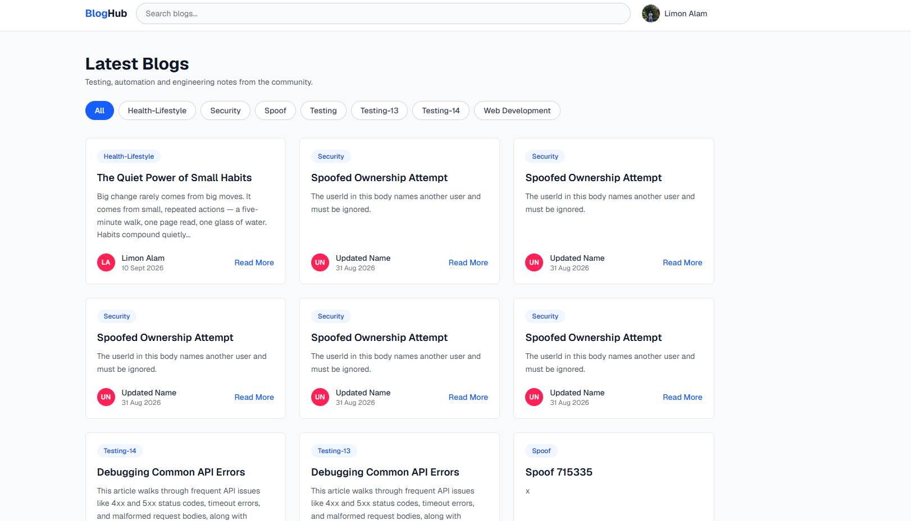
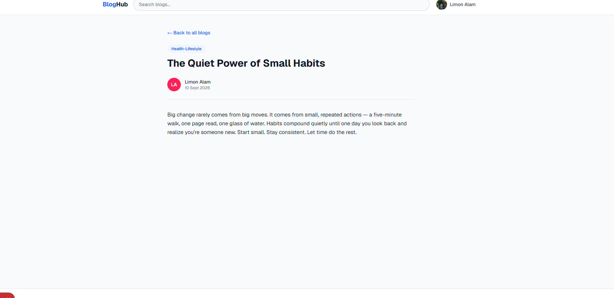
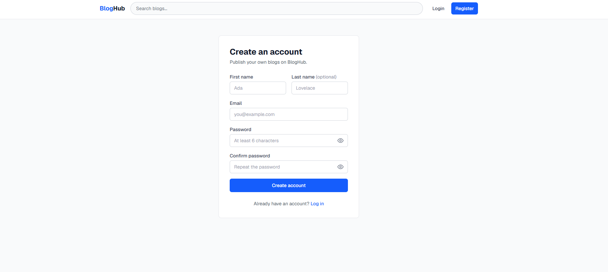
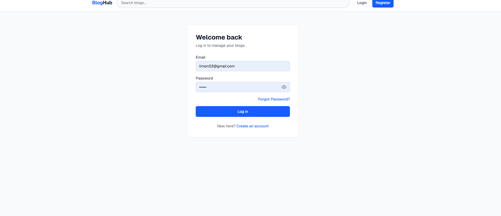
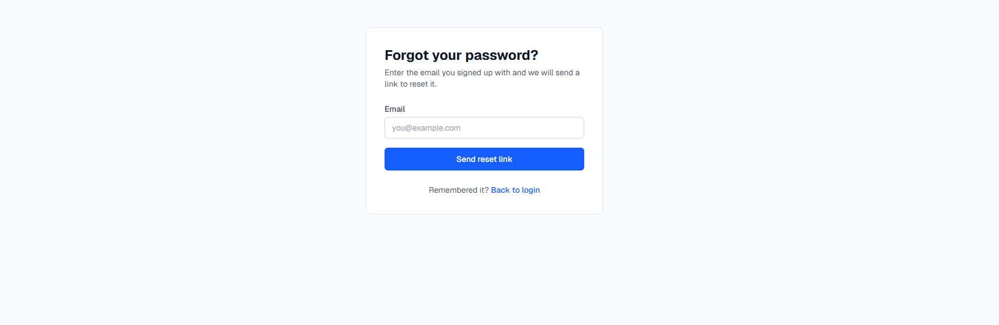
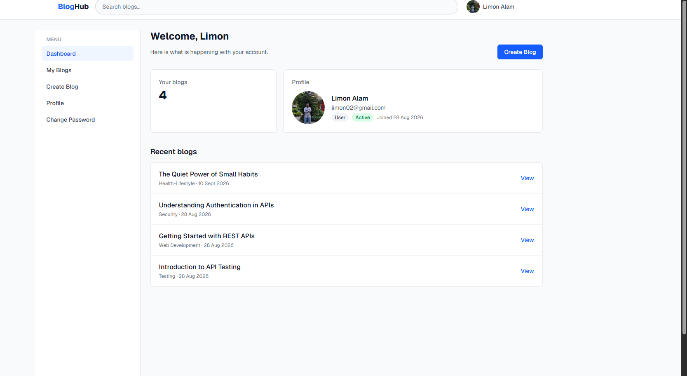
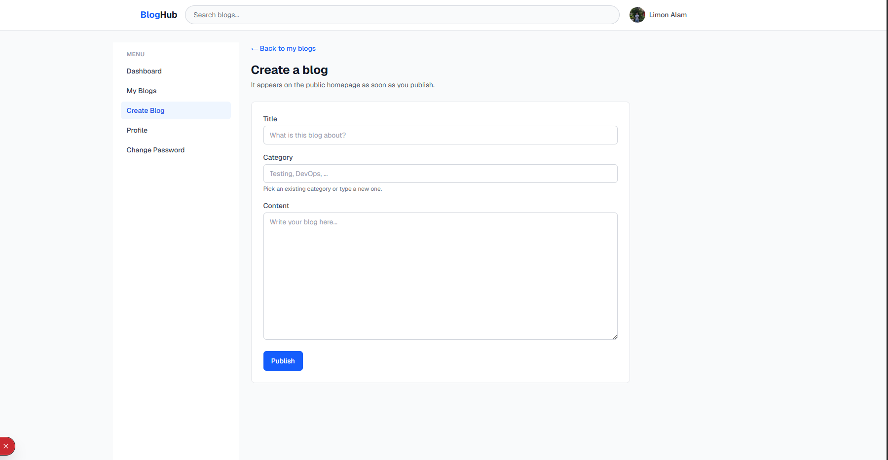
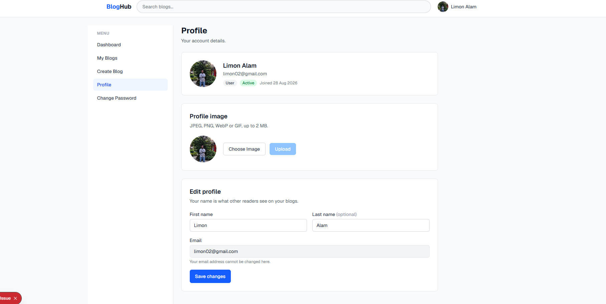

# BlogHub — Blog Management Frontend

A Next.js frontend for the Blog Management REST API in [`../Backend`](../Backend).
Guests discover and read blogs; registered users manage their own profile and
blogs; admins also manage every user and every blog.

Built as the frontend assignment for the Road To SDET module. **Every byte of
data comes from the REST API** — there are no hardcoded blogs, no static JSON,
no mock server and no direct database access.

> **The backend must be running first.** This app has no data of its own. Opened
> against a dead API, every page shows "Cannot reach the server. Make sure the
> API is running." — see [Backend dependency](#backend-dependency).

---

## Main features

**Guest**

- Homepage listing every blog as a card — title, category, preview, author,
  avatar, date
- Debounced title search in the fixed navbar, and category filter pills derived
  from the blogs the API actually holds; both live in the URL
  (`/?title=api&category=Testing`), so a filtered list is shareable and the
  Back button works
- Blog detail page, with a proper **Blog Not Found** state
- Register and log in, with browser-side validation and a show/hide password eye
- Forgot password — requests a reset email

**User**

- Dashboard: welcome line, blog count, profile summary, five most recent blogs
- Create, edit and delete their own blogs (delete asks for confirmation first)
- Profile: edit first and last name, upload a profile image (JPEG / PNG / WebP /
  GIF, up to 2 MB) — the navbar avatar updates immediately, no re-login
- Change password — this device is signed out afterwards
- Logout

**Admin** — everything a user can do, plus

- **All Blogs**: edit or delete any user's blog
- **Users**: list every account, view one in detail, activate / deactivate it

**Across the app**

- Loading skeletons, empty states and the backend's own error message on every
  page; raw JavaScript errors never reach the screen
- Submit buttons disable and say what they are doing (`Publishing...`)
- Responsive at 375px, 768px and 1280px — the sidebar becomes a drawer on
  mobile and wide tables scroll inside their own container

---

## Tech stack

| Layer | Choice |
|---|---|
| Framework | Next.js 16 (App Router), JavaScript |
| UI | React 19 |
| Styling | Tailwind CSS v4 — no second UI framework |
| State | React Context (`AuthContext`) — no state library |
| HTTP | native `fetch`, wrapped once in `utils/api.js` |
| Lint | ESLint 9 with `eslint-config-next` |

---

## Project structure

```
Frontend/
├── app/                      one folder per route (see Application routes)
│   ├── layout.jsx            AuthProvider + Navbar + Footer
│   ├── dashboard/layout.jsx  login guard + Sidebar
│   └── admin/layout.jsx      login guard + admin role guard
├── components/               Navbar, Sidebar, ProfileMenu, BlogCard, BlogForm,
│                             SearchBar, CategoryFilter, Avatar, PasswordInput,
│                             ProfileImageUpload, ConfirmDialog, Loader, Footer
├── services/                 auth / user / blog — one function per endpoint
├── contexts/AuthContext.jsx  user, loading, login, logout, refreshUser
├── utils/                    api.js (the only fetch), auth.js, format.js, url.js
├── Pictures/blog/            screenshots used by this README
└── .env.example
```

Data always flows in one direction:

```
page  ->  component  ->  service  ->  utils/api.js  ->  REST API
```

A page never calls `fetch` itself. `apiFetch` attaches the bearer token, throws
on any non-2xx response with the backend's own message, and turns a network
failure into a readable sentence — so every page handles errors with one
`try/catch`.

---

## Installation

**Requirements:** Node.js 18+, npm, and the backend in [`../Backend`](../Backend)
(which needs MySQL).

```bash
git clone https://github.com/limon27121/blogspace.git
cd blogspace/Frontend
npm install
cp .env.example .env.local
```

Then set `NEXT_PUBLIC_API_URL` in `.env.local` as shown below.

---

## Environment variables

| Variable | Example | Meaning |
|---|---|---|
| `NEXT_PUBLIC_API_URL` | `http://localhost:5000/api` | Base URL of the REST API, **including** `/api` |

```env
NEXT_PUBLIC_API_URL=http://localhost:5000/api
```

- Only variables prefixed `NEXT_PUBLIC_` reach the browser. The API URL has to,
  because every request is made client-side — so never put a secret behind that
  prefix.
- `.env.local` is git-ignored and must not be committed. `.env.example` is the
  committed template and carries no value.
- Next.js reads env files at startup: restart `npm run dev` after changing one.

---

## Backend dependency

The frontend talks to the Express + MySQL API in [`../Backend`](../Backend) —
full setup in its [README](../Backend/README.md). The short version:

```bash
# in MySQL
CREATE DATABASE Blog;
```

```bash
cd ../Backend
npm install
cp .env.example .env      # fill in DB_PASSWORD and a long random SECRET_KEY
npm run dev               # API on http://localhost:5000
```

Backend variables this frontend relies on:

| Variable | Value for local development | Why it matters here |
|---|---|---|
| `PORT` | `5000` | must match the port in `NEXT_PUBLIC_API_URL` |
| `CORS_ORIGIN` | `http://localhost:3000` | the browser blocks every API call from an origin not listed here; comma-separate several |
| `FRONTEND_URL` | `http://localhost:3000` | where the password-reset email link points |
| `SMTP_*` | empty | optional — with no `SMTP_HOST` the reset link is printed to the backend console instead of emailed |

Profile images are served by the backend from `http://localhost:5000/uploads/...`
(outside `/api`, because an `` tag cannot send a token).

**Creating an admin:** there is deliberately no API that grants the admin role.
Register a normal account, then promote it in MySQL and log in again:

```sql
UPDATE users SET role = 'admin' WHERE email = 'admin@example.com';
```

---

## How to run

Start the backend first (above), then from `Frontend/`:

```bash
npm run dev          # development server on http://localhost:3000
```

Production build:

```bash
npm run build
npm start            # serves the build on http://localhost:3000
```

Lint:

```bash
npm run lint
```

---

## Application routes

| Route | Access | Page |
|---|---|---|
| `/` | Public | Blog list, search, category filter |
| `/blogs/[id]` | Public | Blog detail |
| `/register` | Public | Create an account |
| `/login` | Public | Log in |
| `/forgot-password` | Public | Request a password-reset email |
| `/dashboard` | User, Admin | Dashboard home |
| `/dashboard/blogs` | User, Admin | My Blogs (user) / All Blogs (admin), with delete |
| `/dashboard/blogs/create` | User, Admin | Create a blog |
| `/dashboard/blogs/[id]/edit` | User (own blog), Admin (any blog) | Edit a blog |
| `/dashboard/profile` | User, Admin | Profile, profile image, edit name |
| `/dashboard/change-password` | User, Admin | Change password |
| `/admin/users` | Admin | User management |

A guest opening a `/dashboard` or `/admin` route is redirected to `/login`. A
signed-in non-admin opening `/admin/users` sees **Access Denied**.

---

## User vs admin functionality

| Action | Guest | User | Admin |
|---|:---:|:---:|:---:|
| Browse, search, filter and read blogs | ✅ | ✅ | ✅ |
| Register, log in, request a password reset | ✅ | — | — |
| Dashboard | ❌ | ✅ | ✅ |
| Create a blog | ❌ | ✅ | ✅ |
| Edit / delete own blogs | ❌ | ✅ | ✅ |
| Edit / delete **any** blog | ❌ | ❌ | ✅ |
| Edit own name, upload profile image | ❌ | ✅ | ✅ |
| Change own password | ❌ | ✅ | ✅ |
| View all users, view one user | ❌ | ❌ | ✅ |
| Activate / deactivate a user | ❌ | ❌ | ✅ (not their own account) |

The sidebar and profile menu show admin items (**All Blogs**, **Users**) only to
admins — but hiding a menu is not authorization. The role is checked again in
`app/admin/layout.jsx`, and the backend checks it a third time on every request.

---

## Security notes

- **The token is the only source of identity.** No write ever sends `userId`,
  `role` or `isActive`; the backend reads the owner from the token.
- Role and status are displayed as text. There is no control anywhere that could
  change them, including on the user's own profile.
- The JWT is kept in `localStorage`, as the assignment specifies, and read into
  `AuthContext` on mount. It is only ever sent in the `Authorization` header —
  never logged, never put in a URL. (Any script on the page can read
  `localStorage`, so an httpOnly cookie would be stronger; that would need the
  backend to set it.)
- A stale or tampered token is caught on the first profile request: the app
  clears it and treats the visitor as logged out.
- Blog content is rendered as text, never through `dangerouslySetInnerHTML`, so
  an author cannot inject a script into readers' pages.
- The profile image is validated in the browser (type and 2 MB size) and again
  by the backend, which checks the file's real bytes rather than its extension.

---

## Screenshots

**Homepage** — every blog from the API, with category pills built from the
categories that exist



**Category filter** — `Health-Lifestyle` selected


**Blog detail**



**Register**



**Login**



**Forgot password**



**Dashboard**



**Create blog**



**Profile** — profile image upload and name edit; role and status are text only



**Profile menu**


**Change password**


